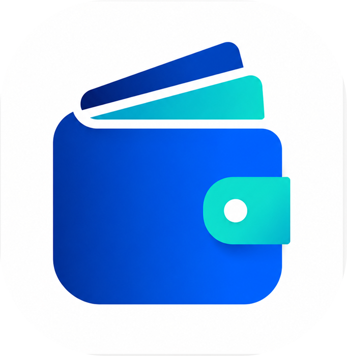

<p align="center">
  
</p>

# Nirpay — Offline CBDC Wallet
**Nirpay** adalah sebuah sistem dompet digital (*digital wallet*) inovatif yang dirancang khusus untuk mendukung penggunaan **CBDC (Central Bank Digital Currency)**. Keunggulan utama dari Nirpay adalah kemampuannya untuk memfasilitasi transaksi pembayaran antar pengguna secara *offline* (tanpa koneksi internet) menggunakan teknologi **NFC** dan **Bluetooth**.

Sistem ini didesain untuk daerah dengan konektivitas rendah atau saat terjadi gangguan jaringan, memastikan transaksi dapat terus berjalan dengan aman dan nantinya akan direkonsiliasi secara otomatis ke server pusat saat perangkat kembali *online*.

## ✨ Status Fitur (Roadmap)

### ✅ Saat Ini Sudah Tersedia (Available Now)
- **Autentikasi & Verifikasi (KYC)**: Pendaftaran pengguna baru lengkap dengan tahapan KYC dan login yang aman.
- **Offline P2P Transfer (NFC)**: Kirim dan terima uang langsung antar pengguna (*peer-to-peer*) tanpa internet menggunakan NFC (Host Card Emulation).
- **Manajemen Wallet**: Melihat saldo, riwayat transaksi lengkap, top-up, dan withdraw.
- **Sinkronisasi Otomatis (Reconciliation)**: Transaksi offline disimpan dengan aman di perangkat lokal dan disinkronkan ke server secara otomatis saat perangkat kembali *online*.
- **Pencegahan Double-Spend**: Backend mendeteksi dan menangani anomali atau upaya pembelanjaan ganda.
- **Dashboard Admin**: Panel web untuk admin memantau pengguna dan data KYC.

### 🚧 Fitur Mendatang (Upcoming / Planned)
- **Offline P2P Transfer (Bluetooth)**: Dukungan transfer tanpa internet alternatif bagi perangkat yang tidak memiliki NFC.
- **Keamanan Biometrik**: Dukungan login dan konfirmasi transaksi menggunakan Fingerprint / Face ID.
- **Manajemen Sengketa (Dispute/Fraud)**: Sistem pelaporan jika terjadi kegagalan rekonsiliasi atau transaksi mencurigakan.
- **Sistem Settlement Lanjutan**: Integrasi *Mock Bank* yang lebih kompleks untuk proses kliring transaksi.

## 🏗️ Struktur Proyek (Monorepo)

Proyek ini adalah *monorepo* yang terdiri dari 3 sistem utama yang saling terhubung:

- 📱 **`client/` (Mobile App)** 
  Aplikasi pengguna akhir yang dibangun menggunakan **Flutter**. Berfungsi sebagai dompet digital offline dengan penyimpanan lokal terenkripsi.
- ⚙️ **`backend/` (API & Core Ledger)**
  Server pusat yang dibangun dengan **PHP (Laravel)**. Bertugas sebagai *mock bank* CBDC, menangani proses sinkronisasi, validasi kriptografi, dan penyelesaian akhir (*settlement*).
- 🖥️ **`dashboard/` (Admin Panel)**
  Web administrasi yang dibangun dengan **Next.js**. Digunakan oleh staf/admin untuk memantau lalu lintas transaksi, verifikasi pengguna (KYC), dan mengawasi kesehatan *ledger*.

## 🛠️ Tech Stack

| Komponen | Teknologi Pendukung |
|---|---|
| **Client** | Flutter, Dart, SQLite (+ SQLCipher), Drift ORM |
| **Backend** | PHP (Laravel), PostgreSQL / SQLite, Redis |
| **Dashboard** | Next.js, React, Tailwind CSS |
| **Keamanan** | AES-256, Ed25519, Argon2 |
| **Konektivitas** | NFC (HCE), Bluetooth |

## 👥 Akun Dummy (Testing)

Untuk mempermudah pengujian aplikasi, kamu bisa menggunakan akun *dummy* berikut untuk masuk ke dalam aplikasi maupun dashboard admin:

### Login di App (Mobile)
| Field | User 1 | User 2 |
|---|---|---|
| **Email** | `user1@gmail.com` | `user2@gmail.com` |
| **Password** | `password` | `password` |
| **PIN** | `123456` | `123456` |
| **Username** | `user1` | `user2` |
| **Nama Lengkap** | User Satu | User Dua |
| **No. Telp** | 081111111111 | 082222222222 |
| **NIK** | 3201234567890001 | 3201234567890002 |
| **Gender** | MALE | FEMALE |
| **KYC Status** | APPROVED | APPROVED |
| **Saldo** | Rp 100.000 | Rp 100.000 |
| **Lokasi** | Jakarta Selatan, DKI | Bandung, Jawa Barat |

### Login di Dashboard (Web Admin)
| Field | Admin 1 | Admin 2 |
|---|---|---|
| **Email** | `admin@nirpay.com` | `admin2@nirpay.com` |
| **Password** | `Admin123` | `Admin123` |
| **Role** | SUPER_ADMIN | ADMIN |

## 🚀 Panduan Instalasi & Menjalankan

Berikut adalah cara menjalankan masing-masing komponen proyek di lingkungan lokal (development):

### 1. Client (Mobile App)
Pastikan kamu telah menginstal SDK Flutter.
```bash
cd client
flutter pub get
flutter run
```

### 2. Backend (API Server)
Pastikan PHP, Composer, dan sistem database sudah tersedia.
```bash
cd backend
composer install
cp .env.example .env
php artisan key:generate
# Sesuaikan konfigurasi database di file .env jika perlu
php artisan migrate
php artisan serve
```

### 3. Dashboard (Admin Web)
Pastikan Backend sudah berjalan karena dashboard membutuhkan API backend.
```bash
cd dashboard
npm install
# Sesuaikan file .env untuk menunjuk ke URL Backend API
npm run dev
```

---
*Catatan: File dan dokumen rancangan internal (sprint plan, wireframe, dll.) dikecualikan dari repository ini dan dikelola secara terpisah.*
